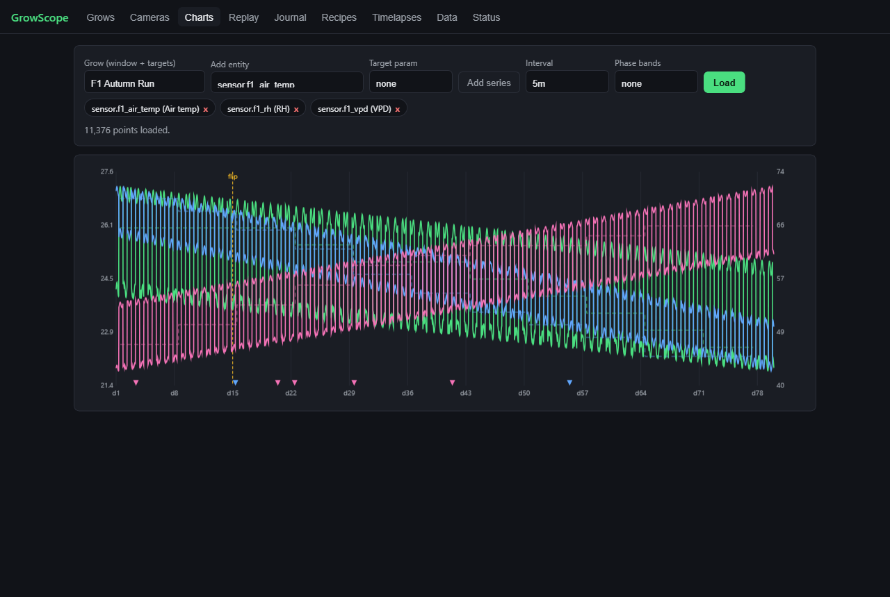
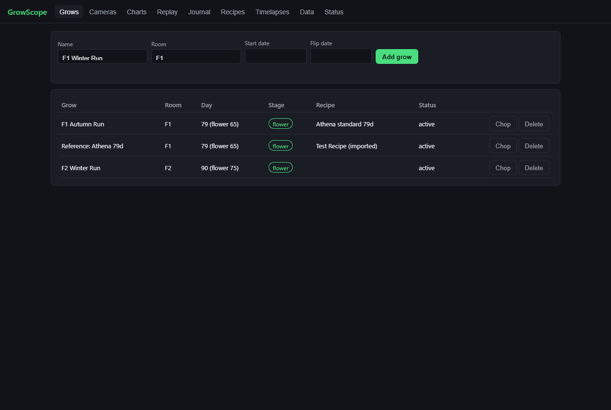
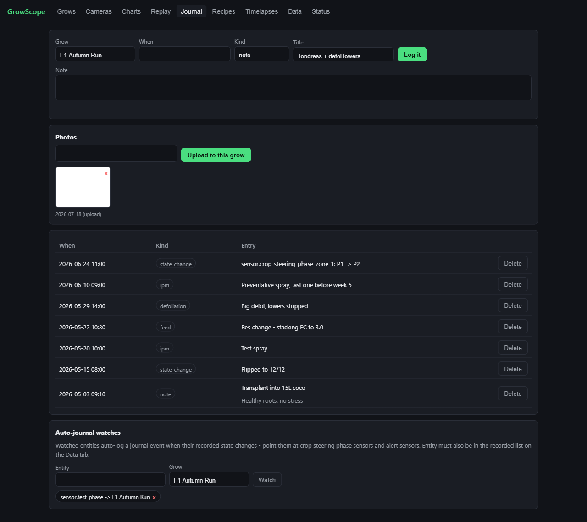
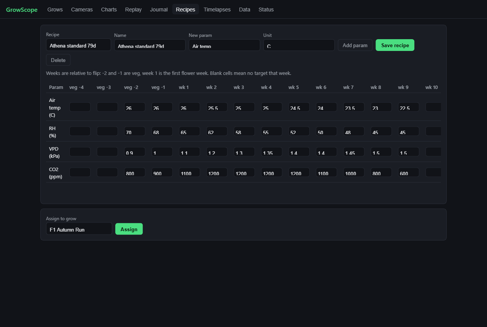
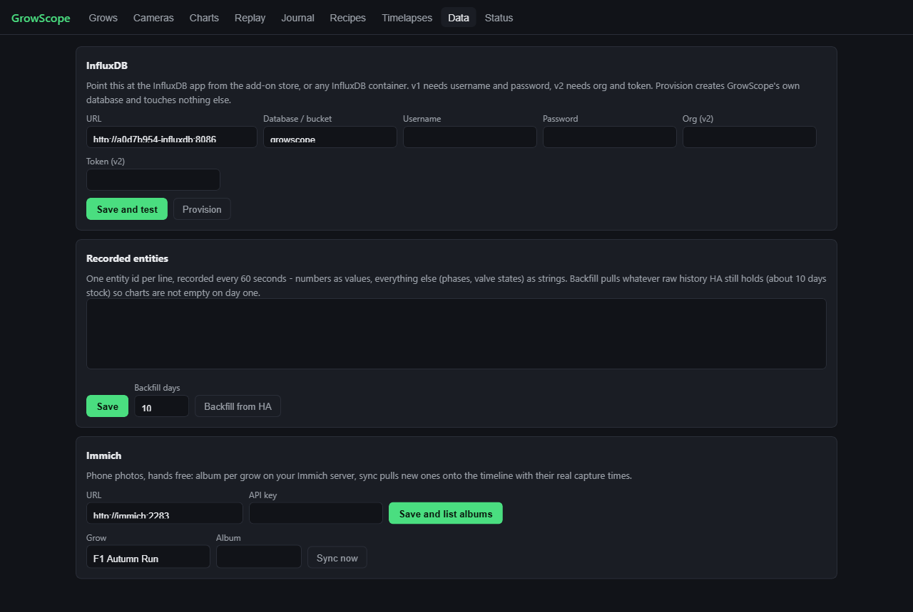

# GrowScope

Grow analytics for Home Assistant. Automatic timelapse capture from any camera entity, a proper grow registry, and full-resolution sensor recording to InfluxDB - so every run you finish becomes a reference you can hold the next one up against.

Built because the existing options each do half the job. Crop steering tools decide when to shoot water but keep no memory. Grow journal apps want you to type everything in by hand. Grafana charts history but knows nothing about grows, days, or flips. GrowScope is the layer that remembers: what the environment did, what the plants looked like, on every day of every cycle.

## What it does today (0.2.0)

- **Automatic timelapse.** Bind a camera entity to a grow and the engine snapshots it on your interval, gated to lights-on (a lights entity or a fixed window - it will not fill your disk with dark frames). Each day gets encoded as its own small segment, and the current timelapse is a concat of segments - always up to date to the most recent frame, rebuilt in seconds, never a full re-encode.
- **Day-normalized video.** Every grow day is the same number of seconds of footage, so day 30 sits at the same timestamp in every grow's timelapse. This is the groundwork for side-by-side replay.
- **Grow registry.** Name, room, start date, flip date, chop date. Day and flower-day counters computed for you and exposed to HA as sensors through the companion integration - `sensor.<grow>_day` in an automation is one click away.
- **Sensor recording.** Point it at your InfluxDB, list the entities you care about, and they get recorded every 60 seconds at full resolution - numbers as values, text states (crop steering phases, valve states) as strings. HA's own recorder purges raw data after about 10 days by default and keeps hourly averages, which flattens drybacks and hides irrigation shots. GrowScope keeps the real signal for the life of the grow.
- **Charts with recipe targets.** Any recorded entities on one chart - room temp next to hallway temp next to outside temp if that is the correlation you are chasing. Day gridlines anchored to the grow, flip marked, drag to zoom, crosshair readout. Build a recipe (weekly setpoints anchored to flip) and the targets draw as dashed step-lines over the measured data, so on-recipe or off-recipe is visible at a glance. Phase bands from crop steering state sensors render behind the series.
- **Replay.** Two grows side by side on the same day-of-cycle clock, aligned by flip (flower day 1 = flower day 1) or by start. The video is the clock - the day is derived from the timelapse manifest, nothing corrects the master backwards, so the stutter-and-rewind failure mode of naive sync is structurally impossible. Scrub one bar, both panes and the day badges follow.
- **Journal and photos on the timeline.** Log feeds, IPM, training - or let auto-journal do it: watch a crop steering phase sensor and every phase change lands on the timeline by itself. Photos upload with their real EXIF capture times, pin onto the replay rail, and a pin click shows both grows' nearest photos side by side. Immich sync pulls an album per grow off your phone hands-free.
- **Grow bundles.** Export a finished grow as one zip - registry, journal, recipe, photos, series export, timelapses. Import someone else's and replay your run against it. This is how a good run stops living in one grower's memory.
- **Automation surface.** Services (growscope.flip, chop, log_event, capture_now, build_timelapse), a growscope_stage_changed event on the bus, and per-grow day/stage sensors - NFC tag on the tent that logs an IPM check is an automation away.
- **Runs anywhere.** HA OS and Supervised get an add-on with ingress. HA Core and Container users run the same engine as a plain Docker container.

## What it does not do yet

Native sidebar panel with HA's own entity pickers (the ingress UI's pickers cover the function meanwhile), Lovelace cards, MQTT push capture, and built-in alert rules (point HA automations at the day/stage sensors instead). See [docs/PLAN.md](docs/PLAN.md) for where it is all headed.

This is an early cut. It works, I run it, but expect rough edges and version-to-version movement until 1.0.

## Screenshots

Charts - a 79-day run with recipe targets (dashed), day grid, flip marker, and journal pins. Demo dataset:

Grow registry with live day and stage counters, and the journal with auto-logged crop steering phase changes:

Recipe editor - weekly setpoints anchored to flip - and the data setup:

## Install

### You need an InfluxDB first

GrowScope does not ship a database - you connect one you own, and your data outlives this app.

- HA OS / Supervised: install the InfluxDB add-on from the add-on store. Two clicks.
- Anywhere else: run an InfluxDB container. v1.8 and v2.x both work, autodetected.

### HA OS / Supervised

1. Settings, Add-ons, Add-on store, three-dot menu, Repositories. Add `https://github.com/JakeTheRabbit/growscope` and refresh.
2. Install GrowScope. Start it. Open it from the sidebar.
3. Data tab: enter your InfluxDB URL and credentials, Save and test, then Provision. It creates its own database and touches nothing else.
4. Grows tab: add your grow. Cameras tab: bind a camera. Done - frames start on the next interval.

Optional but recommended - the companion integration, for grow day sensors in HA:

1. HACS, three-dot menu, Custom repositories. Add `https://github.com/JakeTheRabbit/growscope` as type Integration.
2. Install GrowScope from HACS, restart HA.
3. Settings, Devices and services, Add integration, GrowScope. It defaults to the add-on's local hostname - if you installed from this repo rather than a local build, check the add-on Info page for the actual hostname, or use its IP and port.

### HA Core / Container

Same engine, plain Docker. See [docs/INSTALL.md](docs/INSTALL.md) for the compose file. Short version: run the container with `GROWSCOPE_HA_URL` and `GROWSCOPE_HA_TOKEN` (a long-lived access token) pointing at your HA, mount a media volume, put it behind your own reverse proxy if you want it off-box.

## How the timelapse actually works

1. On each tick the scheduler checks every enabled camera on an active grow. Due and lights on - it pulls a frame through HA's camera proxy. Any camera HA can see works: Reolink, ESPHome, Frigate, ONVIF, whatever. No camera credentials ever touch GrowScope.
2. Frames land in `/media/growscope/frames/<grow>/<camera>/<date>/`, visible in HA's Media Browser and included in whatever backs up your media.
3. Build (button, or nightly at 00:15) encodes any day that changed into a segment - 960x540, capped bitrate, short GOP so scrubbing is snappy - then concats all segments into `<grow>_<camera>_current.mp4`. Concat is a copy, not an encode, which is why rebuilds take seconds.

Failure modes, named: a failed snapshot skips that tick and logs it, check the Status tab then check the camera in HA itself. InfluxDB down pauses recording until it returns - frames keep capturing, the pipelines are independent. A grow with under a day of frames builds a very short and very boring video.

## Bolting onto crop steering

If you run [HA-Irrigation-Strategy](https://github.com/JakeTheRabbit/HA-Irrigation-Strategy), add its sensors to the recorded entities list - VWC, EC, dryback, phase, shots. The phase sensor is a text state, which HA long-term statistics cannot store at all and GrowScope records fine. Full overlays (phases and shots as marks on the charts, targets as lines) are on the roadmap; recording the data now means the history exists when the charts land. [open-crop-steering](https://github.com/JakeTheRabbit/open-crop-steering) reads InfluxDB 2.x, so one database can serve both.

## Contributing

Issues and PRs welcome. Read [docs/PLAN.md](docs/PLAN.md) first so you know where a thing is headed before you build it - happy to talk architecture in an issue before you sink a weekend into something.

## License

MIT.
