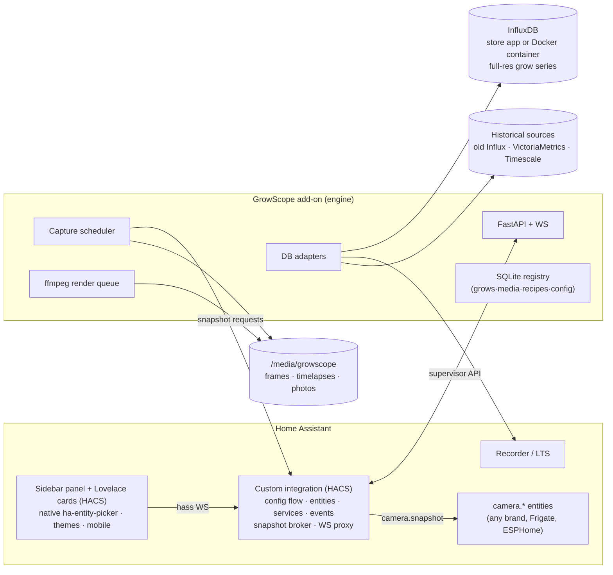

# GrowScope — product plan
### Turning the grow-analytics app into a one-click Home Assistant product

*Working title "GrowScope" (alternatives: OpenGrow, GrowReplay). Plan written 2026-07-18. Source app: `www/grow-analytics` (~2.7k lines JS: app/replay/chart/timelapse/photos/pipeline/cards) + `agency_sensor_analytics_v2` custom component on the work HA.*

---

## 1. What it becomes

**"Frigate for growing."** An open-source, Home-Assistant-native cultivation analytics platform: install the add-on, map your rooms and sensors with HA's own pickers, point it at your cameras — it captures frames automatically, builds always-current timelapses, journals the grow, charts any entity against recipe targets, and lets you **replay any grow against any other on a day-of-cycle clock**. It bolts onto crop-steering/irrigation projects as the analytics + memory layer they don't have.

The replay/compare engine (flip-anchored day normalization, synced dual video, photo compare, recipe overlays) is the moat — nothing in the landscape does it (§3).

## 2. Where it stands today (what we're productizing)

| Piece | Today | Product gap |
|---|---|---|
| Frontend | Vanilla JS modules served from `/local/`, iframe panel, hand-tuned for F1/F2/Veg/Vault | Genericize + convert to native HA panel; config-driven |
| Backend | HA custom component: REST views (grows/media/photos/renders/history), Influx proxy, EXIF, thumbs, ffmpeg renders, LAN-gated writes | Extract into an add-on engine; HA-auth everywhere; SQLite registry |
| Config | Hand-edited `rooms.json`, hardcoded entities/Influx/creds/windows | Admin panel, zero hand-edited files |
| Capture | Ad-hoc HA automations → `www/snapshots/<cam>`; manual renders → `www/timelapses` | Built-in capture scheduler + auto-assembly (§5.5) |
| Data | InfluxDB required (site-specific queries) | InfluxDB kept as the engine store — user connects the store app or their own container; wizard provisions it (§5.1) |
| Photos | Uploads + EXIF + lightbox compare; Immich sync coded, dormant | Config UI for Immich; journal events |
| Replay | v17: video-master-clock, 2-min compare encodes, targets, legacy sensors | Keep as-is; add grow bundles/reference library (§5.7) |

Hard-won runtime lessons already baked in and carried forward: video-is-the-clock sync (drift structurally impossible), 2-minute capped-bitrate compare encodes (dual-pane playback within LAN budgets), short-GOP for scrubbing, serialized blob preloads.

## 3. Landscape — what else exists

*(Researched 2026-07-18; full notes with URLs in §10.)*

- **Crop steering / irrigation** — [HA-Irrigation-Strategy](https://github.com/JakeTheRabbit/HA-Irrigation-Strategy) (MIT, actively developed, HACS integration + `f2-control` add-on, ~100 `crop_steering_*` entities) and [open-crop-steering](https://github.com/JakeTheRabbit/open-crop-steering) (its v0.1 AI-supervisor layer: immutable 84-day recipes + LLM overlays + audit log) are both JakeTheRabbit's stack. They decide *when to shoot water and what the targets are* — neither does photos, timelapse, journaling, or run-vs-run compare. **Complementary, not competing → primary bolt-on targets, with exact entity names to bind against (§5.11).** Same story for the in-house `crop_steering_v2` AppDaemon app and OpenGrowBox-HA.
- **Grow journals** (Grow with Jane, GrowDiaries, GrowBuddy, PLNTRK, Growgoyle, **aigrowapp** — a closed mobile app with an AI assistant, no API, competitor-only): phone-first manual diaries; no sensor ingest, no HA presence. We subsume them: the journal writes itself from sensors + cameras.
- **Compliance ERPs** — **Trellis is dead** (acquired by Akerna 2020, sold off 2023, domain no longer resolves). Compliance is out of scope; if ever needed, the surface to integrate is Metrc's API directly, not an ERP.
- **Mycodo** (3.3k★): closest open-source cousin — has camera timelapse + Influx dashboards — but it's a standalone Raspberry Pi platform, not HA-native, and has no run-vs-run comparison.
- **Commercial incumbents** (AROYA, Pulse): sensor history + alerts at enterprise/subscription prices; weak or no run comparison, no open integration.
- **HA ecosystem**: timelapse today = DIY snapshot automations + manual ffmpeg. The closest packaged attempt ([hassio-camlapse](https://github.com/tolwi/hassio-camlapse), Dec 2025) does interval-snapshot→ffmpeg and has **2 stars** — the feature is wanted, nobody has shipped it well. Frigate proves both the add-on+integration+card architecture and the appetite for camera-centric add-ons.

**Verdict: the day-normalized replay/compare + auto-timelapse + recipe-deviation combo has no incumbent anywhere — hobbyist, open-source, or commercial. The HA grow scene currently glues Grafana + steering entities + phone journals together to get half of it.**

## 4. Architecture — the Frigate pattern

Three artifacts in one monorepo, mirroring the proven Frigate / ESPHome / Music Assistant split:

1. **Add-on = engine.** Docker (amd64+aarch64), Python/FastAPI, ffmpeg bundled. Owns capture scheduling, media store, render queue, DB adapters, registry, REST+WS API, ingress. Data in the add-on data dir + `/media` → included in HA backups for free, frames browsable in HA's Media Browser. Same image runs as bare Docker for HA Container/Core users (documented later, §8).
2. **Integration = HA glue.** Config flow defaults the engine URL to the add-on's well-known internal Docker hostname with a manual-URL override — exactly how Frigate's integration finds its add-on (`http://<repo-hash>-<slug>:<port>`); no fragile discovery machinery. Creates a device per grow with entities (published with `state_class: measurement` so they get native long-term statistics), registers services + events (§5.10). Crucially it's the **snapshot broker**: the engine asks it to capture, it calls `camera.snapshot` with HA's own auth — so *any* camera entity works (Reolink, Frigate, ESPHome cam, ONVIF) with zero credential plumbing.
3. **Frontend = native panel + cards.** Sidebar panel registered *by the integration* (`panel_custom.async_register_panel`, manifest deps `http`/`frontend`/`panel_custom`; data over registered websocket commands). A non-iframe panel lives in the main frontend document → live `hass` object, HA themes, auth, and mobile-app rendering for free, **and access to HA's real `ha-entity-picker`/`ha-selector`/`ha-form`** — with one caveat: those components are lazy-loaded, so the panel force-loads them via the standard card-helpers trick (`loadCardHelpers()` → `getConfigElement()`), unofficial-but-ubiquitous, with a fallback picker built on `config/entity_registry/list` if a release ever breaks it. (A plain ingress iframe gets neither `hass` nor HA components — which is why the panel conversion is P1, not optional polish.) The existing 2.7k-line core (chart engine, replay controller) ports intact inside a thin Lit shell — it's dependency-free already. Plus standalone Lovelace cards (§5.9).

## 5. Feature plan

### 5.1 Data layer — the engine records its own history, maps to any database

**Stock HA's recorder can't carry a grow.** Raw + 5-minute data die at `purge_keep_days` (default 10); beyond that you get hourly mean/min/max only — which flattens drybacks, erases individual irrigation shots, and hides day/night VPD transitions. Worse, text/enum sensors (crop-steering P0–P3 phase!) get no statistics at all. So "just read HA history" is fine for a demo and shit for a 60-day grow.

**Therefore the engine is its own recorder, and its store is InfluxDB.** The moment an entity is bound to a parameter, the integration streams its state changes to the engine, which writes them to Influx with a clean schema (tags: grow/room/zone/entity; enums and events included — phases, valve states — which is what makes the steering overlays in §5.11 possible at all). Retention is per-grow and effectively forever: a finished grow's data is the asset. Downsampling for fast 80-day charts comes from Influx tasks, not homegrown rollup code; the chart engine already handles multi-resolution. On engine downtime it **gap-fills from HA recorder raw** on restart (the 10-day window covers any realistic outage — self-healing).

**We don't bundle a database — the user connects one, and the wizard makes that painless.** InfluxDB is one click away in the HA app store for HAOS/Supervised users, and a plain Docker container for **HA Core/Container users — who get the full stack too** (growscope container + influxdb container, no Supervisor needed). Keeping the DB out of our image means a small engine, no double-hosted database RAM, no DB lifecycle code to maintain, and the user's data outlives our app.

Onboarding does the work:
- **Detect**: the wizard probes the store InfluxDB app at its well-known internal hostname and offers "found it — connect"; if absent, it deep-links the app-store install (or shows the `docker run` one-liner for Core).
- **Provision**: on first connect it creates our database/bucket, retention policies, and downsampling tasks itself — the user never opens an Influx UI.
- **Speak both dialects**: the store app currently ships Influx 1.x while self-hosters run v2 (and v3 via its v1/v2-compat APIs, InfluxQL only) — the engine treats v1 and v2 as equals, autodetected. (v3 Core note: its free tier has recent-data query-window constraints — flagged in §10.6, warn users who pick it.)
- **Reuse, don't duplicate**: if HA's `influxdb` integration is already exporting entities there, the engine **reads those measurements instead of double-writing** (schema-mapping preview in the admin panel) and only records what's missing (enums/phases, unbound entities). This is the crop-steering-scene path — open-crop-steering reads InfluxDB 2.x too, so one TSDB serves the whole stack, and Grafana users keep their dashboards on the same data.

HA recorder/LTS and other TSDBs slot in as adapters (`query(entities, start, end, agg, interval) → series` + `capabilities()`):

| Source | Role |
|---|---|
| **InfluxDB — the store app or any container/external instance** *(the engine store)* | Full-res series for everything bound, for the life of the grow + archive. User-owned; wizard-detected and auto-provisioned. |
| **HA Recorder + LTS** | **Backfill at install** (last ~10 days raw + hourly LTS for older) so charts aren't empty on day one; gap-fill after outages; pre-install history at hourly resolution, honestly labeled. |
| **VictoriaMetrics** | Read via the Influx line/query surface (no dedicated HA integration exists). |
| **TimescaleDB (LTSS)** / direct SQL recorder | Read-only SQL adapters. |
| Prometheus | Later (P6) — pull-model, lowest priority. |

Multiple sources live at once, with **per-parameter source override** — that's the legacy-2025-F1 feature productized ("historical sources": old grows read from an old DB at whatever resolution it has).

Server-side **derived parameters**: VPD (T+RH+leaf offset), DLI (from PPFD), dryback % (from VWC), °C/°F normalization from HA unit metadata. Optionally published back into native HA statistics via `async_import_statistics`, so VPD shows up in stock HA history/statistics cards too.

### 5.2 Parameters & entity picking (the hallway-temp ask)
- A *parameter* is a named series with a role (temp/RH/CO₂/VPD/…/generic). Each parameter binds **any number of entities from any domain or area** through the native HA entity picker — F1 temp + hallway temp + outside temp on one chart is just multi-binding, template sensors and helpers included.
- Rooms map to **HA Areas**: entities are *suggested* by area + device_class, never restricted to them.
- Saved chart presets per room/grow; a **correlation view** for any 2+ series (overlay + scatter + correlation coefficient) — cheap to build, answers exactly the "is hallway temp dragging F1?" question.

### 5.3 Rooms & spaces
Import HA Areas as rooms (F1/F2/Veg/Vault become areas); per-room dashboards assemble from parameter bindings. Nothing hardcoded; `rooms.json` becomes a DB row migrated on first run.

### 5.4 Grows & lifecycle
Configurable stages (germ/veg/flower/flush/dry/cure), flip + chop anchors, expected durations from recipe → forecast dates ("day 43 · flower d29 · ~36 to chop"). Auto-suggest grows from schedule/day-counter entities (existing feature, generalized). Lock/unlock, rooms reassignable (fixes the mis-filed-grow annoyance properly).

### 5.5 Timelapse engine (headline feature)
**Capture** — per camera binding, sources:
- **HA camera entity** via the integration broker (default; works with everything)
- **Frigate** `latest.jpg` API (no double-capture if Frigate's already there)
- **Watch folder** (the current D:\ + Samba-inbox workflow, kept)
- **MQTT/webhook push** (ESP32-cam in a tent)
- **Immich album** (existing sync code, config UI added)

Schedule: every N minutes, gated by a **lights-on condition** (bind a light/switch/schedule entity or fixed window; optional one IR frame per dark period), perceptual-hash dedupe, disk-quota guard. Frames land in `/media/growscope/frames/<grow>/<cam>/<date>/` — visible in HA Media Browser, covered by HA backups.

Capture mechanics (both verified paths, chosen per camera): the broker route — integration calls `camera.snapshot` writing into the shared `/media` mount (add-on maps `media` read-write; both sides see the same files, no transfer) — or the pull route — engine fetches `/api/camera_proxy/<entity>` through the Supervisor's Core proxy with its own token, no user credentials involved. Frigate cameras skip both and pull `latest.jpg?quality=…&h=…` directly.

**Auto-assembly ("grow so far")** — the trick that makes it instant: encode a per-day segment each night (seconds of work), then *concat* segments + a partial tail-day → a rolling timelapse **always current to the most recent frame**, regenerated on demand in seconds, never a full re-encode. Two-rung encode ladder from the session's lessons: 960×540 capped-bitrate short-GOP **compare encode** (duration-normalized so day-sync holds) + 720p/1080p **master**. Final render + optional frame purge at chop.

**Management UI** — per-grow library: frame count, disk use, **coverage calendar with gap detection**, regenerate, trim, set flip anchor, retention policy, "make clip" (date range → mp4/gif for sharing), download.

### 5.6 Journal & photos
- Journal events (feeding, IPM, defol, training, res change, notes) with photos → **pins on the replay timeline** (generalizes the photo-pin system). Quick-log via service call — an NFC tag or dashboard button in the room can log an event.
- **Auto-journal from entities**: subscribe to chosen sensors/events (irrigation shots, EC dosing, CO₂ enrichment state) → events appear on the timeline without anyone typing.
- Photos: existing uploader + EXIF placement + dedupe + lightbox compare; Immich album-per-grow sync gets a config screen and a "test connection" button.

### 5.7 Replay & compare (the moat — keep, then extend)
Everything from v17 survives unchanged: day-of-cycle normalization, flip anchoring, video-master-clock sync, dual-pane photos, recipe overlays, full-width charts, hover-scrub.

New: **grow bundles** — export a grow (registry + compare encode + downsampled series + photos-lite + recipe) as a single file; import anyone's. That enables a **community reference library**: replay *your* week 3 against a known-good Athena-standard run. No other software has this; it's the reason strangers will install it.

### 5.8 Recipes
Curve editor (weekly/daily setpoints per parameter, phase-anchored), JSON import/export, bundled with grows. Target-band shading on charts plus a **deviation score** (time-in-range % per parameter per week) → a one-glance "where did this run go off recipe" report. Write-mode (pushing setpoints to controllers) is deliberately P6 and off by default.

### 5.9 HA-native UI
- **Panel**: inherits HA themes (light/dark/custom), sidebar icon, works in the companion app. Tabs as today: Live / Grows / Replay (+ Admin).
- **Lovelace cards** (HACS): `growscope-status-card` (day/stage/forecast per grow), `growscope-timelapse-card` (latest lapse loop), `growscope-chart-card` (parameter chart with targets), later a mini replay card. Cards are how it embeds into people's existing dashboards — same playbook as ha-timeclock's card.

### 5.10 Automation surface (what makes bolt-ons possible)
| Surface | Examples |
|---|---|
| Entities (device per grow) | `sensor.<grow>_day`, `sensor.<grow>_flower_day`, `select.<grow>_stage`, `binary_sensor.<grow>_active`, `sensor.<grow>_recipe_deviation`, `image.<grow>_latest_frame` |
| Services | `growscope.start_grow`, `.flip`, `.chop`, `.log_event`, `.capture_now`, `.render_timelapse`, `.add_photo` |
| Events | `growscope_stage_changed`, `growscope_capture_done`, `growscope_render_done`, `growscope_alert` |
| Alerts | Threshold/gap rules → HA notify pipeline (phone push "F1 RH 12% over target for 2h — flower d23") |

### 5.11 Integrations & bolt-ons
- **HA-Irrigation-Strategy** (primary): ship a **parameter pack** binding its published entities — `sensor.crop_steering_vwc_zone_N`, `_ec_zone_N`, `_zone_N_dryback_percent`, `_zone_N_shots_today`, `_zone_N_water_today_ml`, `_zone_N_substrate_temp` as chart parameters; its `number.crop_steering_zone_N_vwc_target_p1/p2`, `_ec_target`, `_dryback_target` as **live target lines**; P0→P3 transitions on `sensor.crop_steering_phase_zone_N` + the `sensor.crop_steering_activity_log` feed → **auto-journal entries and shot ticks on the replay timeline** (steering-debug heaven); its `select.crop_steering_zone_N_growth_stage` transitions as stage boundaries. Read-only — we never call its irrigation services.
- **open-crop-steering** (recipe brain): read its 84-day daily-target **recipes + runtime overlays** from the FastAPI backend (:8099) and render *effective* targets (`recipe + Σ overlays`) on charts; import its HMAC audit log as provenance-stamped journal entries; share its InfluxDB rather than re-plumbing. Our recipe schema stays import/export-compatible with its daily-target model (v0.1 — pin versions, expect churn).
- **Frigate**: camera source (`latest.jpg`) + optional recording-backfill for missed frames.
- **Immich**: per-grow album sync (built; gets UI).
- **AI observations (optional module)**: daily latest-frame + 7-day sensor digest → any OpenAI-compatible endpoint (BYO key; 9router/LLM Vision-friendly) → journal entries with stress/deficiency flags. Off by default, zero cloud dependency.
- **Journals/ERPs**: CSV + photo export covers migration from phone journals; compliance (Metrc-style) explicitly out of scope.

## 6. Security model
HA auth end-to-end: panel is native (session auth), engine API reached through ingress/integration proxy only, media via authenticated URLs. The LAN-gating hack dies; Influx creds live only in engine config. No secrets ever reach the frontend.

## 7. Distribution & repo
*(Note: HA renamed "Add-ons" to "Apps" in 2026.2 — same tech, new label; user-facing docs should say Apps.)*
- Monorepo: `/addon` · `/custom_components/growscope` · `/frontend` (panel + cards) · `/docs`. App repo needs `repository.yaml`; `config.yaml` gets `ingress` + `panel_icon`/`panel_title` (sidebar entry), `map: media (rw)` + `share`, `backup: hot`, `arch: [aarch64, amd64]` (32-bit is gone), `image:` on ghcr.
- **One-click paths, honestly:** the app installs via the my.home-assistant *add repository* badge (a prefill regression is open on that redirect — ship manual copy-paste instructions beside it). **HACS has no app/add-on category** — the integration and the card list separately (integration + plugin categories). Default-store review queues run months, so launch instructions lead with HACS custom-repository (works day one) while submissions queue; integration also needs a home-assistant/brands PR (icon).
- CI: the add-on builder toolchain was replaced in April 2026 (BuildKit composite actions; `build.yaml` deprecated) — copy the current `apps-example` builder workflow rather than any older tutorial; plus hassfest + HACS Action + at least one tagged GitHub release (HACS requirement).
- Ingress auth is free and identity-aware: HA fronts all auth, and forwards `X-Remote-User-Id`/`-Name` headers — per-user audit on grow edits costs nothing.
- Docs: 10-minute quickstart + a **bundled demo grow** (sample dataset + timelapse) so Replay demos instantly on a fresh install — first-run experience is the adoption cliff.
- Launch channels: HA community forum thread, PR into [awesome-cropsteering](https://github.com/Intergalactic-XYZ/awesome-cropsteering), the existing crop-steering forum threads, r/homeassistant — and a compatibility shout-out with HA-Irrigation-Strategy (its users are exactly our first cohort).
- License: **MIT** recommended (community traction > SaaS protection). Branding horticulture-neutral — "grow anything: chillies, orchids, mushrooms" — cannabis presets included but not the name on the tin (also keeps store listings frictionless).

## 8. Roadmap

| Phase | Scope | Effort (focused) |
|---|---|---|
| **P0 Extract & skeleton** | Monorepo; add-on image (FastAPI+ffmpeg); port backend out of the custom component; SQLite registry + migrations; ingress serves current UI unchanged; **Ben's site migrated = install #1** | 1–2 wk |
| **P1 Config & data** | Admin panel; **engine recorder on InfluxDB** (connect wizard w/ store-app detection + auto-provisioning, v1/v2 autodetect, state-change capture, downsampling tasks, recorder backfill/gap-fill); parameter/entity-binding model with native pickers; panel_custom conversion; rooms→Areas | 1–2 wk |
| **P2 Timelapse engine** | Capture scheduler + snapshot broker; day-segment auto-assembly; management UI; media-browser layout; watch-folder + Frigate sources | 1–2 wk |
| **P3 Native polish** | Themes, status+timelapse cards, mobile pass, grow entities/services/events | 1 wk |
| **P4 Integrations** | Crop-steering parameter packs + phase/shot overlays; Immich UI; alert rules | 1 wk |
| **P5 Launch** | Grow bundles + reference library; demo dataset; docs; HACS + add-on submissions; v1.0 | 1 wk |
| **P6 Later** | AI module; write-mode setpoints; VictoriaMetrics/Timescale/Prometheus adapters; bare-Docker docs; multi-user roles; share links | ongoing |

~6–9 focused weeks to v1.0. Each phase leaves Ben's own install working (it *is* the dogfood site).

## 9. Migration (the current site)
First-run importer: `rooms.json` → parameter bindings; current registry + `www/timelapses` + `www/snapshots` → engine store; the existing work Influx plugs straight in as the engine's **external store — zero data migration**; legacy-2025 Influx becomes a "historical source". Nothing re-entered by hand; D:\ masters stay as a watch-folder.

## 10. Landscape research notes
*(Live web research, 2026-07-18. Dense facts only.)*

### 10.1 HA-Irrigation-Strategy — [github.com/JakeTheRabbit/HA-Irrigation-Strategy](https://github.com/JakeTheRabbit/HA-Irrigation-Strategy)
Autonomous substrate crop-steering for HA: full daily P0→P3 cycle per zone from live VWC/EC, vegetative/generative steering, closed-loop pore-water EC. Irrigation only — no climate. MIT, free; positioned against ~$3k commercial controllers. Small but active: 17★, latest release v2.11.0 (2026-06-28), [community thread](https://community.home-assistant.io/t/ha-irrigation-strategy-crop-steering-system-automated-irrigation-with-vwc-ec-sensors/1002435).
**Architecture (current — no longer AppDaemon/blueprints):** HACS custom integration (`custom_components/crop_steering/`, config-flow wizard, ~100 entities, sensor fusion) + **`f2-control` add-on** (valve engine, ingress dashboards, polls HA REST) + pure-Python `decide()` core, unit-tested offline. Validates our add-on+integration architecture from inside the niche.
**Read surface (stable contract = entities):** VWC/EC/dryback/peak-VWC/substrate-temp per zone, `_shots_today`, `_water_today_ml`, `_daily_volume_ml`, phase + phase-timer per zone, rolling `sensor.crop_steering_activity_log`, alert sensors (`_under_drink_alert`, `_valve_stuck_open_alert`). Targets as `number.*` (VWC p1/p2, EC target/ceiling, dryback target) + `select.*` (steering mode, growth stage). Services exist (`custom_shot`, `transition_phase`, …) — we stay read-only. No MQTT/webhooks; HA WS/REST + recorder/LTS is the path.
**Gaps = our features:** charts are basic 24h trends; activity log ≠ journal; no photos, no timelapse, no run-vs-run compare; setpoint planner exists (`www/setpoints.html`) but no deviation scoring.

### 10.2 open-crop-steering — [github.com/JakeTheRabbit/open-crop-steering](https://github.com/JakeTheRabbit/open-crop-steering)
AI supervisor **on top of** #1 ("we use it for shot mechanics; we don't fork it"). Converts recipes into **immutable, versioned 84-day daily-target plans** (temp/RH/CO₂/light/irrigation/nutrients); LLM applies time-bounded runtime **overlays** inside deterministic guardrails (per-param delta caps, allowed-action sets, no-touch windows, risk classes); **HMAC-chained audit log** for GACP-grade provenance; autonomy modes Report/SFW/YOLO. MIT, v0.1 pre-release (3★, 14-phase roadmap). Stack: HA add-on or Docker; FastAPI + SQLAlchemy + bundled Postgres 16; Next.js 15 frontend; reads InfluxDB 2.x; OpenAI-compatible LLM endpoint (default LiteLLM); Telegram alerts; port 8099; RBAC.
**Attachment:** read recipes + overlays from its API and render **effective target = recipe + Σ(active overlays)**; ingest `audit_event` as journal entries; share its Influx. Its recipe schema is the one to stay compatible with. API unstable at v0.1 — pin versions.

### 10.3 aigrowapp — [aigrowapp.com](https://aigrowapp.com)
Closed cannabis mobile app with an AI assistant ("Bud"), team-oriented. No published maker, pricing, API, export, or HA hook — competitor black box, not an integration target. (Name collides with ≥3 unrelated "AIGrow" products — greenhouse app, Instagram SaaS, journal app — ignore those.)

### 10.4 Trellis — defunct
The cannabis Trellis (trellisgrows.com, ex-CannSoft) was an enterprise seed-to-sale **compliance ERP** — [acquired by Akerna 2020](https://www.globenewswire.com/news-release/2020/04/08/2013798/0/en/Akerna-Acquires-Cultivation-Compliance-Software-Company-Trellis.html), [sold off with Akerna's software business 2023](https://mjbizdaily.com/akerna-sells-cannabis-software-businesses-for-5-million/); domain no longer resolves. Never hobbyist, never HA-adjacent, now gone. Compliance stays out of scope (Metrc API if ever needed).

### 10.5 Everything else (one-liners)
[Mycodo](https://github.com/kizniche/Mycodo) (3.3k★, GPL, RPi — timelapse + Influx dashboards + PID, no HA, no compare) · [HAGR](https://github.com/JakeTheRabbit/HAGR) (Jake's broader climate+steering set, AppDaemon) · [OpenGrowBox-HA](https://github.com/OpenGrow-Box/OpenGrowBox-HA) (autonomous VPD/climate HA integration, freemium) · Grafana+Influx (the DIY charting default; no journal/timelapse) · AROYA / Pulse (commercial incumbents; enterprise pricing, weak compare) · Growgoyle (post-harvest batch analytics — nearest thing to run comparison in the journal tier) · PLNTRK, Grow with Jane, GrowDiaries, GrowBuddy, Hempie (phone journals; manual entry) · [awesome-cropsteering](https://github.com/Intergalactic-XYZ/awesome-cropsteering) (the scene's index — target it for launch visibility).

HA timelapse prior art specifically: [hassio-camlapse](https://github.com/tolwi/hassio-camlapse) (interval snapshots → ffmpeg renders + retention; v0.1.0 Dec 2025, 2★, custom-repo only — exact feature, zero adoption) · [mjpeg-timelapse](https://github.com/evilmarty/mjpeg-timelapse) (fake camera replaying fetched stills — playback trick, no video files) · [advanced_snapshot](https://github.com/Phil7989/advanced_snapshot) (snapshot+crop+overlay building block) · [motionEye add-on](https://github.com/hassio-addons/addon-motioneye) (mature native timelapse, but a whole standalone NVR, not entity-camera based).

### 10.6 Build-time technical references (verified 2026-07-18)
Facts the architecture leans on, verified against current docs/source — with the things to re-check at build time:
- Recorder WS APIs: `history/history_during_period`, `recorder/statistics_during_period` (`5minute|hour|…`, ms-epoch timestamps), `recorder/list_statistic_ids`; hourly LTS never purged, 5-min + raw bounded by `purge_keep_days` (default 10); no statistics for text/enum sensors; `async_import_statistics` for writing derived series. **Design consequence: recorder is backfill/gap-fill only — the engine records full-res history into a user-connected InfluxDB (store app or container; no DB bundled in our image). Verify at build: the store app's current Influx major version (1.x at research time), and v3 Core free-tier long-range query constraints (warn users who pick v3).**
- Panels: `panel_custom.async_register_panel` from an integration (deps `http`/`frontend`/`panel_custom`, `async_register_static_paths`, WS commands for data). Native pickers in-document but lazy-loaded → force-load via `loadCardHelpers()` + `getConfigElement()` (de-facto standard, **unofficial — keep a fallback picker**). Ingress iframes get no `hass` and no HA components.
- Add-on↔integration wiring: well-known internal hostname `{repo-hash}-{slug}` as config-flow default (Frigate's `DEFAULT_HOST` pattern) + manual URL; Supervisor `/discovery` exists but is under-documented for custom services — treat as optional nicety.
- Snapshots: `camera.snapshot` into a shared rw `media` mount, or engine-side `GET http://supervisor/core/api/camera_proxy/<entity>` with the Supervisor token; Frigate `latest.jpg?quality&h` (0.16+: authenticated :8971 vs internal :5000).
- Packaging: "Apps" rename (2026.2); builder toolchain replaced Apr 2026 (copy `apps-example` workflow; `build.yaml` deprecated); `arch: [aarch64, amd64]` only; HACS = integration + plugin categories separately, months-long default queue (custom-repo path works immediately), brands PR for the integration icon; my.home-assistant add-repo badge has an open prefill regression — ship manual instructions too.
- Consuming crop-steering entities: entity-id coupling via `async_track_state_change_event` is the supported contract (never import their Python); scope pickers with `filter: {integration: crop_steering}`.

## 11. Open decisions
1. **Name** — GrowScope / OpenGrow / GrowReplay (pick before P0; repo rename is cheap, add-on slug rename is not).
2. **License** — MIT (default) vs AGPL.
3. **P0 start** — say the word and the monorepo + add-on skeleton goes up first session.
